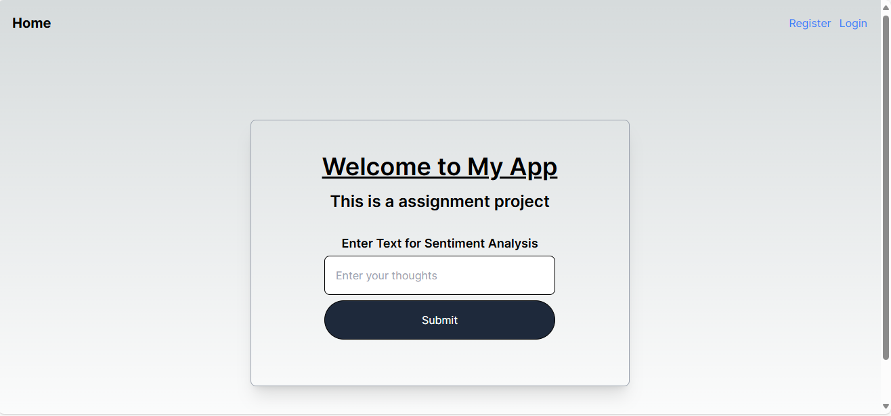
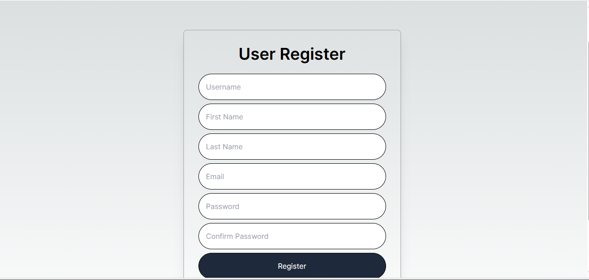
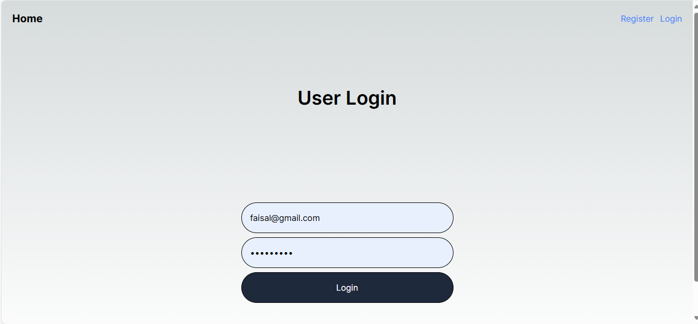
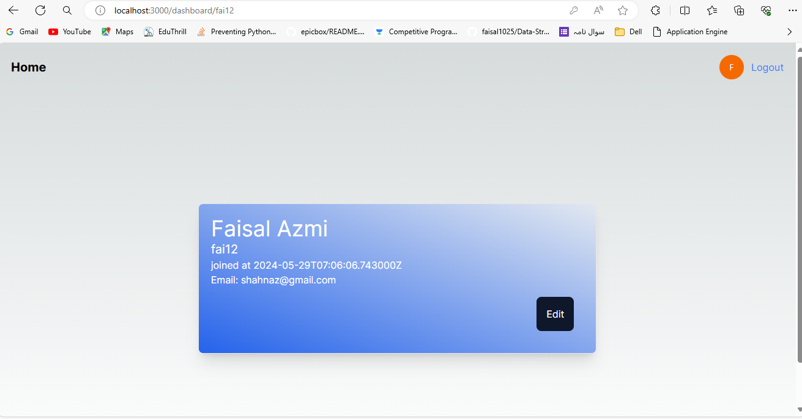
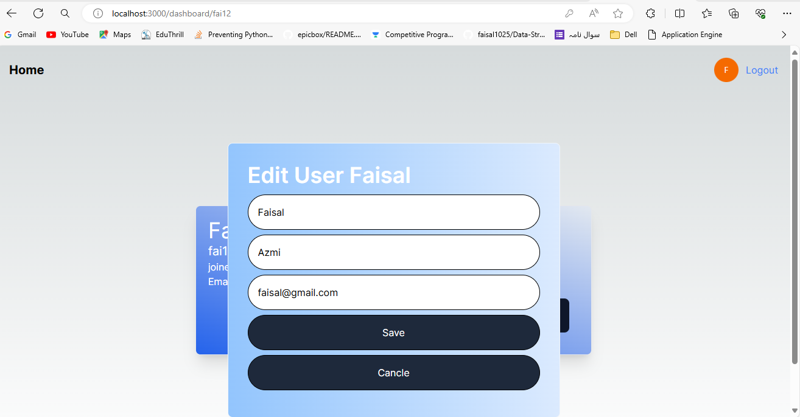
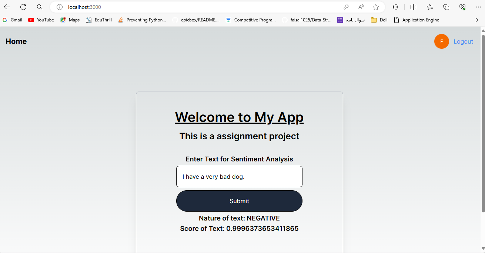

# Assignment Project

Hello, This is the UI part of the assignment project where I have a created a view of home page of a tect analyzer application for using this text analyzer the user needs to be login first only authenticated user is allowed.

## Home Page

This is the home page user interface. We need to register first to make a account on the platform

## Register Page

After register the user get the access token which is stored in the user localstorage

## Login Page

Login page is used to login any existing user account

## User Dashboard

This is the user dashboard with the user details. User can also update this informations

## Analyzer Page 

Now in the analyzer form in the home page we can afer login we can put text to analyze and it gives us result

## Step to setup
- Clone the repo
- Install all dependencies using `npm install`
- Run server using `npm run dev`

Your server will start running

Thanks for being with me and review my project. Hope a positive response from your side. 

<strong>For depth knowledge of backend please visit my backend repository <a href='https://github.com/faisal1025/Aspireit-API'>click here</a></strong>

